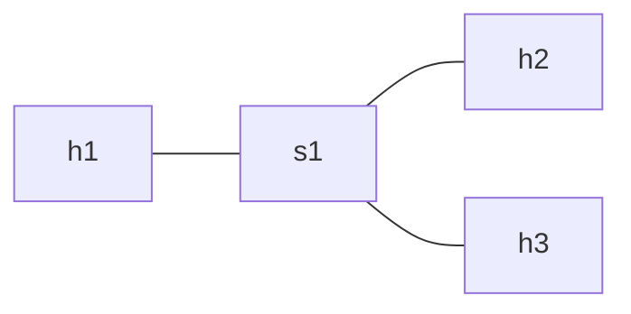

# SDN Mininet Network Utilization Monitor

## 📌 Objective
To monitor network traffic using SDN by collecting real-time port statistics from OpenFlow switches using a Ryu controller.

---

## 🧠 Concept
This project demonstrates:
- SDN architecture (Controller + Switch)
- Flow rule behavior
- Network monitoring using OpenFlow statistics

---

## 🏗️ Topology
Single switch topology with 3 hosts:


---

## ⚙️ Setup

Install dependencies:
```bash
sudo apt update
sudo apt install mininet python3-ryu iperf
```
---

## 🧪 Testing

---

## 🟢 Normal Scenario

### What we did:
We ran basic connectivity and traffic tests in a working SDN network.

### Steps:
```bash
mininet> pingall
mininet> iperf h1 h2
```
---
## Failure Scenario (Link breakdown)
### What we did:
We ran the same basic connectivity  and traffic tests as above only this time we induce a link breakdown artificially on our own

### Steps:
```bash
mininet>link s1 h1 down
mininet>pingall
mininet>iperf h1 h2
```
---
## Results
Refer Screenshots folder for result photos

